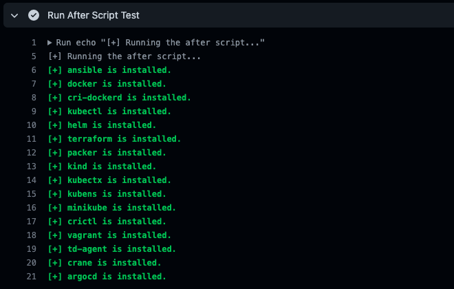

<div align="center" id="top"> 
  
</div>

<h1 align="center">DevOps Installer</h1>

<p align="center">
  
  
  
  
  <!-- 
   -->
  
</p>

<h4 align="center">
	🚧  Installer 🚀 Under construction...  🚧
</h4>

<hr>

<p align="center">
  <a href="#dart-about">About</a> &#xa0; | &#xa0; 
  <a href="#sparkles-features">Features</a> &#xa0; | &#xa0;
  <a href="#rocket-technologies">Technologies</a> &#xa0; | &#xa0;
  <a href="#white_check_mark-requirements">Requirements</a> &#xa0; | &#xa0;
  <a href="#checkered_flag-starting">Starting</a> &#xa0; | &#xa0;
  <a href="#memo-license">License</a> &#xa0; | &#xa0;
  <a href="https://github.com/devenes" target="_blank">Author</a>
</p>

<br>

## :dart: About

Installer is an open source project that is developed by [Devenes](http://www.github.com/devenes) to download and install packages and applications such as ansible, docker, cri-dockerd, kubectl, helm, terraform, packer, kind, kubectx, kubens, minikube, crictl, vagrant, td-agent, crane, argocd for using on test environments and production environments, Ubuntu Server on [Microsoft Azure](https://azure.microsoft.com/en-us/) and Amazon Linux EC2 instance of [AWS](https://aws.amazon.com/) cloud infrastructures.

## :sparkles: Features

:heavy_check_mark: Install package\
:heavy_check_mark: Test the installation\
:heavy_check_mark: Support for multiple operating systems

## :rocket: Technologies

The following tools were used in this project:

- [Bash](https://www.gnu.org/software/bash/)

## :white_check_mark: Requirements

Before starting :checkered_flag:, you need to have Ubuntu or Amazon Linux operating system.

## :checkered_flag: Starting

```bash
# Clone this project
git clone https://github.com/devenes/installer

# Access
cd installer

# Install packages
sudo bash installer.sh

# Test the installation
bash installer.sh
```

## GitHub Actions CI

You can use the GitHub Actions CI to test the installation of packages and applications.

<div align="center"> 
  
</div>

## :memo: License

This project is under license from Apache. For more details, see the [LICENSE](LICENSE.md) file.

Made with :heart: by <a href="https://github.com/devenes" target="_blank">devenes</a>

&#xa0;

<a href="#top">Back to top</a>
